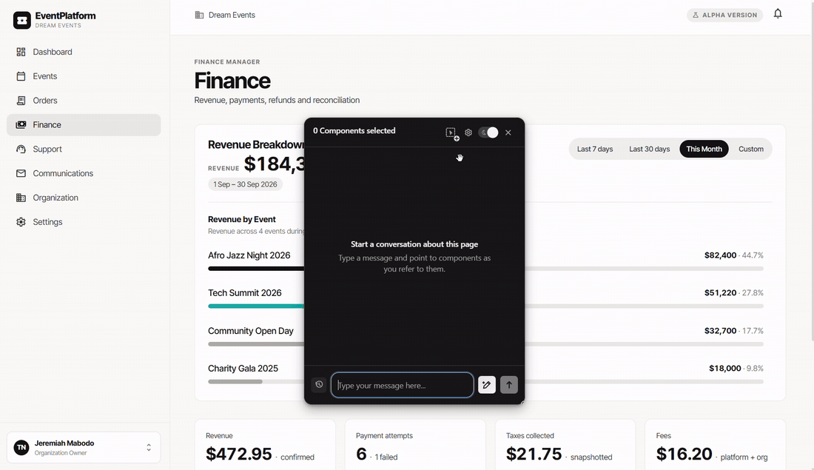
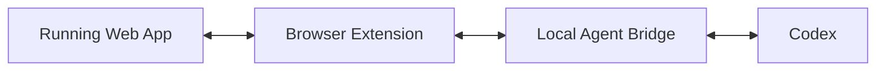

# PointBack

**Talk to your coding agent where you see the problem.**

PointBack is a browser extension for discussing a running UI with a coding agent.

Instead of copying selectors, hunting for the right component, switching back to your editor, and explaining what you're looking at, you point at the UI and start the conversation there.

```text
point at UI
→ select component
→ ask a question
→ PointBack resolves context
→ Codex responds in the browser
→ continue the conversation
```

PointBack is still a work in progress. The current version proves the core interaction; the next focus is making conversations reliably stay attached to components as the UI changes.

## Demo



## Why PointBack?

Coding agents understand repositories well, but the browser and the agent still live in different contexts.

You can see *this button*. The agent can see `SubmitButton.tsx`. PointBack is an attempt to connect those two worlds so questions like:

> Why is this wider than the element above it?

can carry the relevant UI and component context automatically.

The longer-term goal is for discussions to remain spatially attached to the interface: leave the page, come back later, see which components have discussions, and continue where you left off.

## What works today

The current build includes component selection and highlighting, DOM/React component resolution, component ancestry and source metadata where available, multi-turn conversations with Codex, streamed product events, local SQLite conversation history, Codex session resume, Shadow DOM UI isolation, and a local authenticated agent bridge.

The browser extension never needs to understand Codex CLI details. It talks to PointBack's local bridge using product-level messages and events.

## Try it

### Requirements

- Node.js **22.18+**
- pnpm **11.1.2**
- Google Chrome
- Codex CLI installed and logged in (`codex login`)
- A local web project you want PointBack to inspect

Clone the repository and install dependencies:

```sh
pnpm install
pnpm build
```

Load this directory as an unpacked extension in `chrome://extensions`:

```text
apps/browser-extension/.output/chrome-mv3
```

Enable **Developer mode**, choose **Load unpacked**, and select that directory.

Next, start the local bridge from the repository root and point it at the project you want Codex to work with.

macOS/Linux:

```sh
POINTBACK_PROJECT_DIRECTORY=/path/to/your/project pnpm dev:bridge
```

PowerShell:

```powershell
$env:POINTBACK_PROJECT_DIRECTORY = 'C:\path\to\your\project'
pnpm dev:bridge
```

The bridge listens on:

```text
http://127.0.0.1:3000
```

It will print a pairing token. Open PointBack's connection settings and enter the bridge address and token.

> **Startup is still developer-oriented.** The current setup deliberately exposes the moving parts while PointBack is under active development. A simpler startup flow is planned so users won't need to manually configure the bridge, project directory, address, and pairing token. The intended experience is closer to installing the extension and running a single PointBack command from the project you want to work on.

Now open your application in Chrome:

```text
1. Activate PointBack's selector.
2. Select a UI element.
3. Ask a question about it.
4. Continue with a follow-up question.
5. Close and reopen the panel, or reload the page.
6. Open Chat history to continue the saved conversation.
```

The bridge currently runs Codex in a **read-only** mode. PointBack does not provide a code-writing/approval flow yet.

For extension development:

```sh
pnpm dev:extension
```

For the component workspace:

```sh
pnpm storybook
```

## Architecture



The repository is a pnpm workspace:

```text
apps/
  browser-extension/   WXT extension and browser mechanics
  agent-bridge/        Fastify API, Codex adapter and SQLite history
  component-lab/       Storybook and browser integration tests

packages/
  protocol/            Shared PointBack contracts
  ui/                  Shared React components and styles
```

A deliberate boundary in the extension is that live DOM elements and React Fiber objects stay in browser-specific code. The rest of PointBack works with normalized component context and opaque handles.

That keeps React responsible for PointBack's UI while pointer tracking, geometry, DOM inspection and component resolution remain browser mechanics.

## Component identity

The next major problem is deciding what it means for a rendered component to still be *the same component* after a rerender or refactor.

PointBack does not assume that a CSS selector, line number, or file path is a permanent identity. The direction is to match components using several pieces of evidence—source location, component ancestry, stable props/keys, route and runtime structure—and fall back to manual confirmation when confidence is low.

That work will power the feature I care most about next:

```text
talk about component
→ leave
→ return later
→ PointBack finds it again
→ discussion marker appears
→ continue the conversation
```

## Status

PointBack is being built in public and the interaction is still evolving.

Right now I'm deliberately keeping the scope narrow: make the running UI a useful conversational interface to an existing coding agent, rather than turning PointBack into another IDE.
